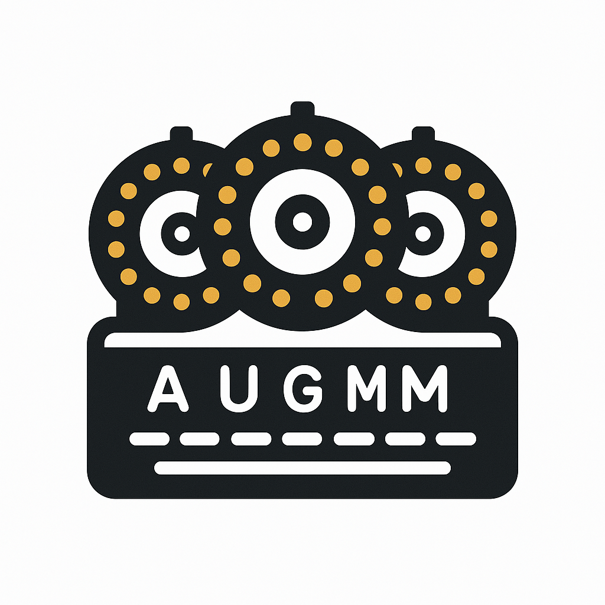

# Enigma Machine in Python

[Enigma cypher machine](https://cryptomuseum.com/crypto/enigma/) implementation in pyhton.




## Prerequisites

You only need pyhon 3 installed to run the application

## Usage

The implementation contains the full behavior of the original Enigma machine as well as its extension the Enigma M3. In order to use it:


### Decyphering a message

In order to decypher a message you need a message cyphered by an Enigma machine. For this example we will take the following message:

```
QEOB

DUHF TETO LANO TCTO UARB BFPM HPHG CZXT DYGA HGUF XGEW KBLK GJWL QXXT
GPJJ AVTO CKZF SLPP QIHZ FXOE BWII EKFZ LCLO AQJU LJOY HSSM BBGW HZAN
VOII PYRB RTDJ QDJJ OQKC XWDN BBTY VXLY TAPG VEAT XSON PNYN QFUD BBHH
VWEP YEYD OHNL XKZD NWRH DUWU JUMW WVII WZXI VIUQ DRHY MNCY EFUA PNHO
TKHK GDNP SAKN UAGH JZSM JBMH VTRE QEDG XHLZ WIFU SKDQ VELN MIMI THBH
DBWV HDFY HJOQ IHOR TDJD BWXE MEAY XGYQ XOHF DMYU XXNO JAZR SGHP LWML
RECW WUTL RTTV LBHY OORG LGOW UXNX HMHY FAAC QEKT HSJW DUHF TETO
```

1. Load the code into the python 3 interpreter and then instantiate the machine:

```python
import sys
sys.path.insert(0, "./code")

from Enigma import Enigma
```

2. Instantiate the Enigma machine with whatever configuration you desire:

```python
enigma = Enigma('Thin C', 'Beta', '568', 'EPEL', 'NAEM', 'AE BF CM DQ HU JN LX PR SZ VW')
```

3. Obtain initial configuration decyphering the first four group letter from the message:

```python
print(enigma.code_text("QEOB"))
>> CDSZ
```

Discard the first group of letters. The new message would be:
```
DUHF TETO LANO TCTO UARB BFPM HPHG CZXT DYGA HGUF XGEW KBLK GJWL QXXT
GPJJ AVTO CKZF SLPP QIHZ FXOE BWII EKFZ LCLO AQJU LJOY HSSM BBGW HZAN
VOII PYRB RTDJ QDJJ OQKC XWDN BBTY VXLY TAPG VEAT XSON PNYN QFUD BBHH
VWEP YEYD OHNL XKZD NWRH DUWU JUMW WVII WZXI VIUQ DRHY MNCY EFUA PNHO
TKHK GDNP SAKN UAGH JZSM JBMH VTRE QEDG XHLZ WIFU SKDQ VELN MIMI THBH
DBWV HDFY HJOQ IHOR TDJD BWXE MEAY XGYQ XOHF DMYU XXNO JAZR SGHP LWML
RECW WUTL RTTV LBHY OORG LGOW UXNX HMHY FAAC QEKT HSJW DUHF TETO
```

4. Adjust the Enigma machine with the new initial position:

```python
enigma.set_grundstellung('CDSZ')
```

5. Eliminate the first and last two groups from the message:

```python
    sendschreiben = preprocess_sendschreiben[10:len(preprocess_sendschreiben)-10]
```

The updated message is:
```
LANO TCTO UARB BFPM HPHG CZXT DYGA HGUF XGEW KBLK GJWL QXXT\nGPJJ AVTO CKZF SLPP QIHZ FXOE BWII EKFZ LCLO AQJU LJOY HSSM BBGW HZAN\nVOII PYRB RTDJ QDJJ OQKC XWDN BBTY VXLY TAPG VEAT XSON PNYN QFUD BBHH\nVWEP YEYD OHNL XKZD NWRH DUWU JUMW WVII WZXI VIUQ DRHY MNCY EFUA PNHO\nTKHK GDNP SAKN UAGH JZSM JBMH VTRE QEDG XHLZ WIFU SKDQ VELN MIMI THBH\nDBWV HDFY HJOQ IHOR TDJD BWXE MEAY XGYQ XOHF DMYU XXNO JAZR SGHP LWML\nRECW WUTL RTTV LBHY OORG LGOW UXNX HMHY FAAC QEKT HSJW
```

6. Finally decypher the message:
```python
print(enigma.code_text(sendschreiben))
```

The result is:
```
KRKR ALLE XXFO LGEN DESI STSO FORT BEKA NNTZ UGEB ENXX ICHH
ABEF OLGE LNBE BEFE HLER HALT ENXX JANS TERL EDES BISH ERIG XNRE ICHS
MARS CHAL LSJG OERI NGJS ETZT DERF UEHR ERSI EYHV RRGR ZSSA DMIR ALYA
LSSE INEN NACH FOLG EREI NXSC HRIF TLSC HEVO LLMA CHTU NTER WEGS XABS
OFOR TSOL LENS IESA EMTL ICHE MASS NAHM ENVE RFUE GENY DIES ICHA USDE
RGEG ENWA ERTI GENL AGEE RGEB ENXG EZXR EICH SLEI TEIK KTUL PEKK JBOR
MANN JXXO BXDX MMMD URNH FKST XKOM XADM XUUU BOOI EXKP
```

### Cyphering a message

To cyphenr a message follow the reverse process.
